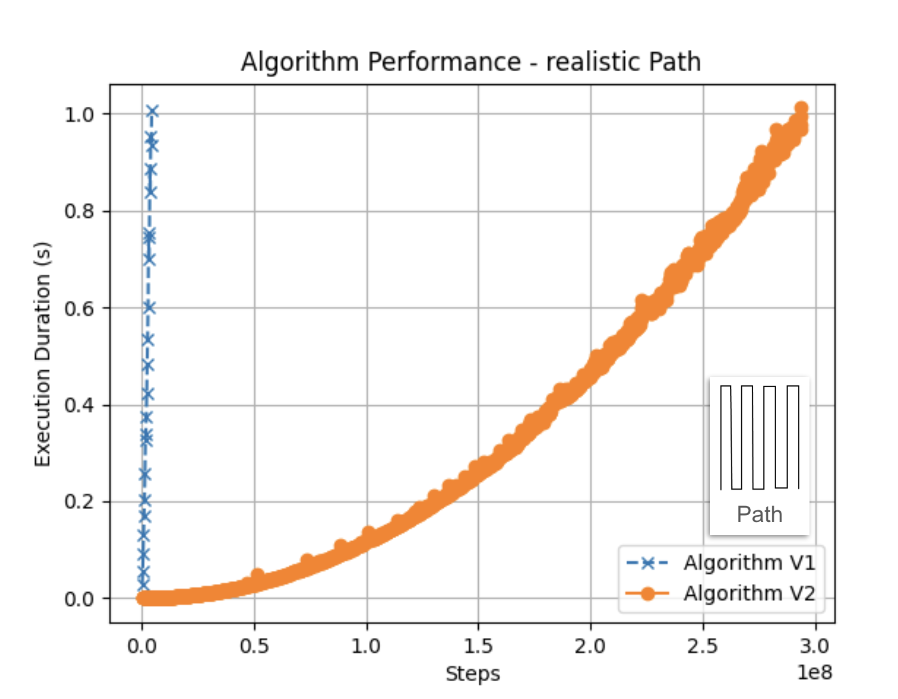
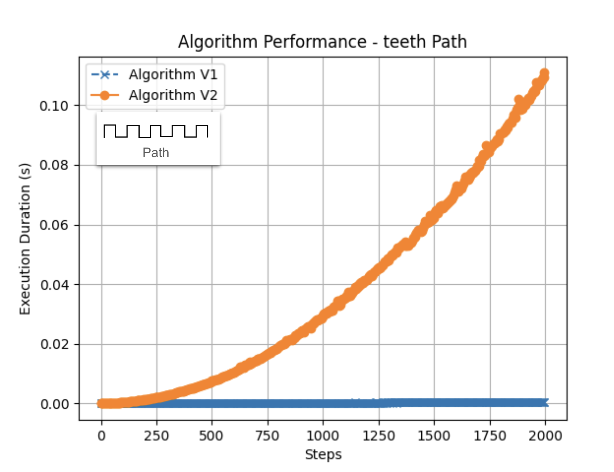

# Algorithm overview

To process the input commands, I have developed 2 algorithms. 

The first algorithm ([`app/execute_commands_v1.py`](app/execute_commands_v1.py)) uses a `set` to store the visited points `(x, y)`. Using a set is advantageous over a list because it automatically handles duplicates, ensuring each point is unique. The algorithm processes each command and its steps sequentially, resulting in a time complexity of `O(c * s)` and a space complexity of `O(c * s)`, where `c` is the number of commands and `s` is the average number of steps per command.

For the version 2 implementation ([`app/execute_commands_v2.py`](app/execute_commands_v2.py)), I created a class called `Line` to store visited locations as vertical and horizontal lines. The `Line` data structure has three properties: `constant`, `start`, and `end`. For example, a vertical line from `(0,0)` to `(0,4)` is represented as `Line(constant=0, start=0, end=4)`.

After creating lines for each command `(O(c))`, the overlapping lines are merged `(O(c log(c)))`, and the crossing positions (duplicated points) are calculated `(O(cˆ2))`. Finally, the total number of visited locations is determined by calculating the size of the final vertical and horizontal lines and subtracting the number of crossing points.

## Algorithms performances analysis

### Time complexity

The time complexity of the V1 implementation is linear with respect to the total number of steps multiplied by the total number of commands in the input. In contrast, the V2 implementation has a quadratic time complexity relative to the number of commands. Given the problem constraints, where `0 ≤ number of commands ≤ 10000` and `0 < steps < 100000`, the maximum number of commands squared (10000²) is significantly lower than the maximum number of commands multiplied by the maximum number of steps `(10000 * 100000)`. Additionally, considering that in a realistic scenario the cleaning robot would likely operate in long lines, the V2 algorithm generally offers better performance.

I conducted a benchmark by writing performance tests that increase the number of commands and steps. These tests are available in the `/tests/performance_tests` directory. The test suite generates graphs of steps versus execution time, which are stored in the `/images` folder.

#### Realistic path
The graph demonstrates that in realistic scenarios, the V2 algorithm is significantly faster than V1. The test was limited to a maximum algorithm execution duration of 1 second. V1 could only complete a few executions before reaching this limit, whereas V2 was able to handle more executions within the same timeframe.

#### Teeth Path

In contrast, for the "teeth" path scenario where the step size is always one and the number of lines is large, the V1 algorithm outperformed V2. This is because the number of commands significantly impacts the time complexity for V2, making the algorithm slower in such cases.

    
    

### Space complexity

The V1 algorithm saves all the visited points in memory. Considering the constraints, the maximum space used could be the maximum number of commands multiplied by the maximum number of steps `(10,000 * 100,000)`, where a tuple of integers is stored to represent each point. Therefore, considering an integer is 4 bytes, the maximum space used for the tuple (int, int) is 8 bytes. This results in a maximum space usage of `8 * 10,000 * 100,000 = 8,000,000,000 bytes` or approximately 8 GB.

In contrast, the V2 algorithm uses lines to store visited locations. The maximum number of lines is equal to the maximum number of commands `(10,000)`. Each line is represented by three integers (constant, start, end), resulting in a space usage of 12 bytes per line. Therefore, the maximum space used by the V2 algorithm is `12 * 10,000 = 120,000 bytes` or approximately 120 KB.

Thus, the V2 algorithm is significantly more space-efficient compared to the V1 algorithm.